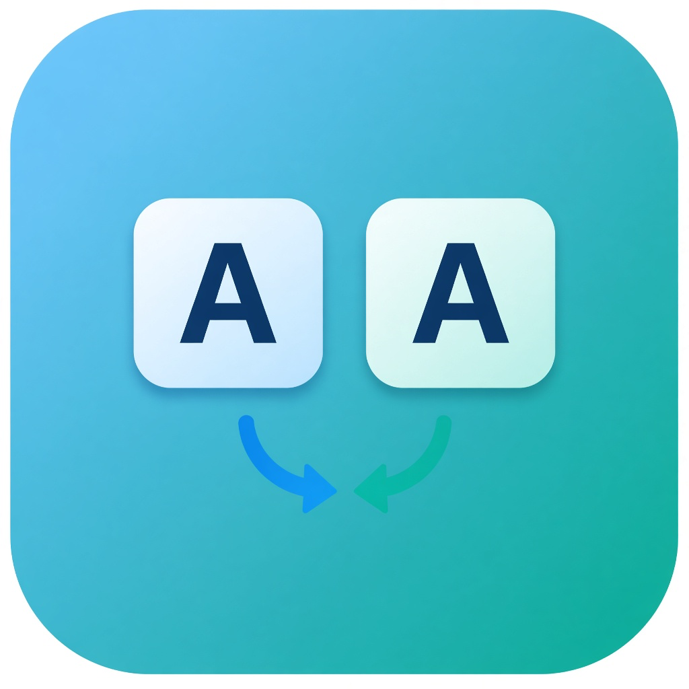

# KeySwitcher

Menu bar утилита для macOS (Apple Silicon), которая быстро чинит текст, набранный не в той раскладке — удобная замена привычек из Punto Switcher.

Набрали `ghbdtn` вместо «привет»? Одно сочетание клавиш — и слово на месте.

<p align="center">
  
</p>

## Что умеет

| Действие | По умолчанию |
|---|---|
| Сменить раскладку **последнего слова** или **выделения** | Right ⌘ + Right ⇧ |
| Сменить **регистр** выделенного текста (lower → UPPER → Title) | Right ⌘ + Right ⌥ |

Хоткеи настраиваются в Settings. Срабатывание — на **отпускание** клавиш.

Работает в большинстве приложений: Cursor, Sublime Text, браузеры, Word (через fallback) и обычные Cocoa-поля.

## Требования

- macOS 14+
- Apple Silicon (arm64)
- Разрешения: **Accessibility** и **Input Monitoring**

## Установка для коллег

1. Скачайте `KeySwitcher-*.dmg` или `KeySwitcher-*.pkg` из [Releases](../../releases) (или соберите сами — см. ниже).
2. **PKG** — двойной клик, мастер установки → Next → Install. В конце пакет можно отправить в Корзину.
3. **DMG** — откройте диск и либо запустите `.pkg`, либо перетащите `KeySwitcher.app` в `Applications`.
4. Выдайте разрешения:
   - Системные настройки → Конфиденциальность и безопасность → **Универсальный доступ**
   - Системные настройки → Конфиденциальность и безопасность → **Мониторинг ввода**
5. Меню KeySwitcher (иконка клавиатуры в **строке меню**) → **Permissions…** → **Retry Start Monitoring**.

> Строка меню (menu bar) — полоска вверху экрана справа, где часы и Wi‑Fi. KeySwitcher живёт там как menu bar app и не занимает Dock по умолчанию.

## Сборка из исходников

```bash
# Проверка логики EN↔RU / буфера
swift run --disable-sandbox KeySwitcherTestRunner

# .app
./Scripts/build-app.sh
open dist/KeySwitcher.app

# Установка в /Applications + подпись
./Scripts/install.sh

# Релиз для раздачи: .app + .pkg (мастер) + .dmg
./Scripts/package-release.sh 1.0.0
```

Нужны Command Line Tools (`xcode-select --install`). Полный Xcode для сборки не обязателен.

## Как это устроено (коротко)

- Глобальный `CGEventTap` слушает клавиатуру и хоткеи
- In-memory буфер помнит последнее слово (не пишется на диск)
- Конвертация EN ↔ RU по физическим клавишам (QWERTY ↔ ЙЦУКЕН)
- Выделение: Accessibility API, при необходимости clipboard
- Смена системной раскладки через TIS

Телеметрии нет. Текст никуда не отправляется.

## Ограничения

- Secure Input (поля паролей) недоступен для перехвата
- В некоторых приложениях (крупные файлы Sublime, Electron) Accessibility ограничен — тогда используется запасной путь через буфер обмена
- Нужны оба системных разрешения; после смены подписи иногда приходится перевыдать их

## Лицензия

[CC BY-NC 4.0](https://creativecommons.org/licenses/by-nc/4.0/) — можно свободно использовать и менять **для личных и некоммерческих целей** с указанием авторства. Коммерческое использование без согласия автора не допускается.

Подробности — в файле [`LICENSE`](LICENSE).
